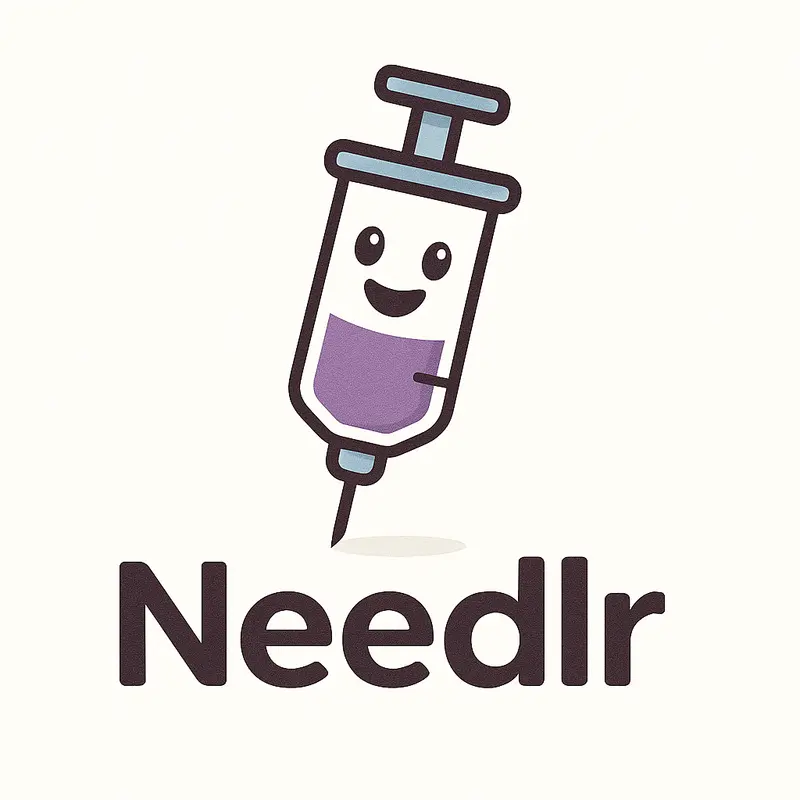

# Needlr

Needlr is an opinionated fluent dependency injection library for .NET that provides automatic service registration and web application setup through a simple, discoverable API. It's designed to minimize boilerplate code by defaulting to registering types from scanned assemblies automatically.

**Needlr is source-generation-first**: The default approach uses compile-time source generation for AOT compatibility and optimal performance. Reflection-based discovery is available as an explicit opt-in for dynamic scenarios.

## Features

- **Source Generation First**: Compile-time type discovery for AOT/trimming compatibility
- **Reflection as Opt-In**: Dynamic type discovery available when needed
- **Automatic Service Discovery**: Automatically registers services from assemblies using conventions
- **Fluent API**: Chain-able configuration methods for clean, readable setup
- **ASP.NET Core Integration**: Seamless web application creation and configuration
- **Plugin System**: Extensible architecture for modular applications
- **Multiple Type Registrars**: Built-in support for default registration and Scrutor-based scanning
- **Flexible Filtering**: Control which types get registered automatically
- **Decorator Pattern Support**: Built-in support for service decoration with `AddDecorator` extension
- **Post-Build Plugins**: Execute configuration after the main service collection has been built
- **Configuration Integration**: Automatic IConfiguration registration and support
- **Assembly Provider**: Flexible assembly scanning with filtering and sorting options

## 📚 Documentation

**[Getting Started Guide →](docs/getting-started.md)** - New to Needlr? Start here for a step-by-step introduction.

Additional documentation:
- [Core Concepts](docs/core-concepts.md) - Understand the architecture and design
- [Plugin Development](docs/plugin-development.md) - Create custom plugins to extend functionality
- [Advanced Usage](docs/advanced-usage.md) - Complex scenarios and optimization techniques

## Quick Start

### Source Generation (Recommended)

For AOT-compatible applications with compile-time type discovery:

```csharp
using NexusLabs.Needlr.AspNet;
using NexusLabs.Needlr.Injection;
using NexusLabs.Needlr.Injection.SourceGen;

var webApplication = new Syringe()
    .UsingSourceGen()
    .ForWebApplication()
    .BuildWebApplication();

await webApplication.RunAsync();
```

### Reflection-Based (Dynamic Scenarios)

For applications that need runtime type discovery:

```csharp
using NexusLabs.Needlr.AspNet;
using NexusLabs.Needlr.Injection;
using NexusLabs.Needlr.Injection.Reflection;

var webApplication = new Syringe()
    .UsingReflection()
    .ForWebApplication()
    .BuildWebApplication();

await webApplication.RunAsync();
```

### Auto-Configuration (Bundle)

For convenience with automatic fallback from source-gen to reflection:

```csharp
using NexusLabs.Needlr.AspNet;
using NexusLabs.Needlr.Injection;
using NexusLabs.Needlr.Injection.Bundle;

var webApplication = new Syringe()
    .UsingAutoConfiguration()
    .ForWebApplication()
    .BuildWebApplication();

await webApplication.RunAsync();
```

## Installation

Add the core package and choose your discovery strategy:

```xml
<!-- Core dependency injection (abstractions only) -->
<PackageReference Include="NexusLabs.Needlr.Injection" />

<!-- CHOOSE ONE: Source Generation (recommended for AOT) -->
<PackageReference Include="NexusLabs.Needlr.Injection.SourceGen" />
<PackageReference Include="NexusLabs.Needlr.Generators" OutputItemType="Analyzer" ReferenceOutputAssembly="false" />
<PackageReference Include="NexusLabs.Needlr.Generators.Attributes" />

<!-- CHOOSE ONE: Reflection (for dynamic scenarios) -->
<PackageReference Include="NexusLabs.Needlr.Injection.Reflection" />

<!-- CHOOSE ONE: Bundle (includes both with auto-fallback) -->
<PackageReference Include="NexusLabs.Needlr.Injection.Bundle" />

<!-- ASP.NET Core web applications -->
<PackageReference Include="NexusLabs.Needlr.AspNet" />

<!-- Optional: Scrutor-based type registration -->
<PackageReference Include="NexusLabs.Needlr.Injection.Scrutor" />

<!-- Optional: Carter framework integration -->
<PackageReference Include="NexusLabs.Needlr.Carter" />

<!-- Optional: SignalR integration -->
<PackageReference Include="NexusLabs.Needlr.SignalR" />

<!-- Optional: Semantic Kernel integration -->
<PackageReference Include="NexusLabs.Needlr.SemanticKernel" />
```

## Core Concepts

### Syringe

The `Syringe` class is the main entry point for configuring dependency injection in Needlr. It provides a fluent API for setting up:

- **Discovery Strategy**: Source generation (`.UsingSourceGen()`) or reflection (`.UsingReflection()`)
- **Type Registrars**: How services are registered (default or Scrutor-based)
- **Type Filterers**: Which types should be registered automatically
- **Assembly Providers**: Which assemblies to scan for services

```csharp
// Source generation approach (recommended)
var syringe = new Syringe()
    .UsingSourceGen()
    .UsingAssemblyProvider(builder => builder
        .MatchingAssemblies(x => x.Contains("MyApp"))
        .Build());

// Reflection approach (dynamic scenarios)
var syringe = new Syringe()
    .UsingReflection()
    .UsingScrutorTypeRegistrar()
    .UsingAssemblyProvider(builder => builder
        .MatchingAssemblies(x => x.Contains("MyApp"))
        .Build());
```

### WebApplicationSyringe

For web applications, use `ForWebApplication()` to transition to web-specific configuration:

```csharp
var webApp = new Syringe()
    .UsingSourceGen()
    .ForWebApplication()
    .UsingOptions(() => CreateWebApplicationOptions.Default)
    .BuildWebApplication();
```

## Service Registration

### Automatic Registration

Services are automatically registered based on conventions. By default, Needlr will:

- Register classes as both themselves and their interfaces
- Use appropriate lifetimes (Transient/Singleton based on type filtering)
- Skip types marked with `[DoNotAutoRegister]`

### Preventing Auto-Registration

Use the `[DoNotAutoRegister]` attribute to exclude types from automatic registration. This is typically done when you need manual control over service registration:

```csharp
[DoNotAutoRegister]
public class ManuallyRegisteredService
{
    // This won't be automatically registered
}
```

### Custom Services

By default, a custom class you create (public or internal) will get picked up automatically and be available on the dependency container:

```csharp
internal class WeatherProvider
{
    private readonly IConfiguration _config;
    
    public WeatherProvider(IConfiguration config)
    {
        _config = config;
    }
    
    public WeatherData GetWeather()
    {
        // Implementation
    }
}
```

The above class would be available for use in minimal APIs and can be injected into other types resolved from the dependency container.

## Manual Service Registration

While Needlr automatically registers services by convention, you may need to manually register services for more complex scenarios like decorator patterns, conditional registration, or when you need precise control over service lifetimes and configurations.

### Preventing Auto-Registration

Use the `[DoNotAutoRegister]` attribute to exclude types from automatic registration:

```csharp
using NexusLabs.Needlr;

[DoNotAutoRegister]
public sealed class MyService : IMyService
{
    public void DoSomething()
    {
        Console.WriteLine("Hello, from Dev Leader!");
    }
}
```

### Manual Registration with IServiceCollectionPlugin

Create a plugin that implements `IServiceCollectionPlugin` to manually configure services:

```csharp
using Microsoft.Extensions.DependencyInjection;
using NexusLabs.Needlr;

internal sealed class MyPlugin : IServiceCollectionPlugin
{
    public void Configure(ServiceCollectionPluginOptions options)
    {
        // Register service manually as singleton
        options.Services.AddSingleton<IMyService, MyService>();
    }
}
```

### Decorator Pattern Example

Here's a complete example showing manual registration with a decorator pattern:

```csharp
using Microsoft.Extensions.DependencyInjection;
using NexusLabs.Needlr;
using NexusLabs.Needlr.Injection;

// Interface
public interface IMyService
{
    void DoSomething();
}

// Base service implementation
[DoNotAutoRegister]
public sealed class MyService : IMyService
{
    public void DoSomething()
    {
        Console.WriteLine("Hello, from Dev Leader!");
    }
}

// Decorator that adds additional behavior
[DoNotAutoRegister]
public sealed class MyDecorator(IMyService wrapped) : IMyService
{
    public void DoSomething()
    {
        Console.WriteLine("---BEFORE---");
        wrapped.DoSomething();
        Console.WriteLine("---AFTER---");
    }
}

// Plugin for manual registration
internal sealed class MyPlugin : IServiceCollectionPlugin
{
    public void Configure(ServiceCollectionPluginOptions options)
    {
        options.Services.AddSingleton<MyService>();
        options.Services.AddSingleton<IMyService, MyDecorator>(s => 
            new MyDecorator(s.GetRequiredService<MyService>()));
    }
}

// Usage (with source generation)
var serviceProvider = new Syringe()
    .UsingSourceGen()
    .BuildServiceProvider();
serviceProvider.GetRequiredService<IMyService>().DoSomething();
// Output:
// ---BEFORE---
// Hello, from Dev Leader!
// ---AFTER---
```

The `IServiceCollectionPlugin` is automatically discovered and registered by Needlr, so you don't need to manually register the plugin itself.

### Manual Registration with Scrutor Decoration

When using Scrutor type registrar, you can leverage Scrutor's decoration extensions for cleaner decorator pattern implementation:

```csharp
using Microsoft.Extensions.DependencyInjection;
using NexusLabs.Needlr;
using NexusLabs.Needlr.Injection;
using NexusLabs.Needlr.Injection.Scrutor;

// Interface and service implementations (same as above example)
// ...

// Plugin using Scrutor decoration extensions
internal sealed class MyScrutorPlugin : IServiceCollectionPlugin
{
    public void Configure(ServiceCollectionPluginOptions options)
    {
        // Register the base service first
        options.Services.AddSingleton<IMyService, MyService>();
        
        // Use Scrutor to decorate the service
        options.Services.Decorate<IMyService, MyDecorator>();
    }
}

// Usage with Scrutor type registrar (requires reflection)
var serviceProvider = new Syringe()
    .UsingReflection()
    .UsingScrutorTypeRegistrar()
    .BuildServiceProvider();

serviceProvider.GetRequiredService<IMyService>().DoSomething();
// Output:
// ---BEFORE---
// Hello, from Dev Leader!
// ---AFTER---
```

This approach is cleaner than manual decorator registration as Scrutor handles the complex dependency injection logic internally.

### Using AddDecorator Extension

Needlr provides a convenient `AddDecorator` extension method that simplifies decorator registration:

```csharp
using NexusLabs.Needlr.Injection;
using NexusLabs.Needlr.Injection.SourceGen;

var serviceProvider = new Syringe()
    .UsingSourceGen()
    .UsingPostPluginRegistrationCallback(services =>
    {
        // Register the base service
        services.AddSingleton<IMyService, MyService>();
    })
    .AddDecorator<IMyService, MyDecorator>()
    .BuildServiceProvider();

serviceProvider.GetRequiredService<IMyService>().DoSomething();
// Output:
// ---BEFORE---
// Hello, from Dev Leader!
// ---AFTER---
```

The `AddDecorator` extension automatically wraps the existing service registration with the decorator, preserving the original service's lifetime.

## Plugin System

Needlr supports a plugin architecture for modular applications:

### Web Application Plugins

```csharp
internal sealed class WeatherPlugin : IWebApplicationPlugin
{
    public void Configure(WebApplicationPluginOptions options)
    {
        options.WebApplication.MapGet("/weather", (WeatherProvider weatherProvider) =>
        {
            return Results.Ok(weatherProvider.GetWeather());
        });
    }
}
```

### Web Application Builder Plugins

```csharp
public sealed class CarterWebApplicationBuilderPlugin : IWebApplicationBuilderPlugin
{
    public void Configure(WebApplicationBuilderPluginOptions options)
    {
        options.Logger.LogInformation("Configuring Carter services...");
        options.Builder.Services.AddCarter();
    }
}
```

## Examples

### Minimal Web API (Source Generation)

The following example has a custom type automatically registered and a minimal API that will consume it:

```csharp
using NexusLabs.Needlr.AspNet;
using NexusLabs.Needlr.Injection;
using NexusLabs.Needlr.Injection.SourceGen;

var webApplication = new Syringe()
    .UsingSourceGen()
    .ForWebApplication()
    .BuildWebApplication();
await webApplication.RunAsync();

internal sealed class WeatherPlugin : IWebApplicationPlugin
{
    public void Configure(WebApplicationPluginOptions options)
    {
        options.WebApplication.MapGet("/weather", (WeatherProvider weatherProvider) =>
        {
            return Results.Ok(weatherProvider.GetWeather());
        });
    }
}

internal sealed class WeatherProvider(IConfiguration config)
{
    public object GetWeather()
    {
        var weatherConfig = config.GetSection("Weather");
        return new
        {
            TemperatureC = weatherConfig.GetValue<double>("TemperatureCelsius"),
            Summary = weatherConfig.GetValue<string>("Summary"),
        };
    }
}
```

### Fluent Configuration (Reflection with Scrutor)

```csharp
using NexusLabs.Needlr.AspNet;
using NexusLabs.Needlr.Injection;
using NexusLabs.Needlr.Injection.Reflection;
using NexusLabs.Needlr.Injection.Scrutor;

var webApplication = new Syringe()
    .UsingReflection()
    .UsingScrutorTypeRegistrar()
    .UsingAssemblyProvider(builder => builder
        .MatchingAssemblies(x =>
            x.Contains("NexusLabs", StringComparison.OrdinalIgnoreCase) ||
            x.Contains("MyApp", StringComparison.OrdinalIgnoreCase))
        .UseLibTestEntryOrdering()
        .Build())
    .UsingAdditionalAssemblies(additionalAssemblies: [])
    .ForWebApplication()
    .UsingOptions(() => CreateWebApplicationOptions
        .Default
        .UsingStartupConsoleLogger())
    .BuildWebApplication();

await webApplication.RunAsync();
```

## Source Generation vs Reflection

| Feature | Source Generation | Reflection |
|---------|-------------------|------------|
| **AOT Compatible** | ✅ Yes | ❌ No |
| **Trimming Safe** | ✅ Yes | ❌ No |
| **Startup Performance** | ✅ Faster | ⚠️ Slower |
| **Dynamic Plugin Loading** | ❌ No | ✅ Yes |
| **Runtime Assembly Scanning** | ❌ No | ✅ Yes |

**Use Source Generation when:**
- Building AOT-compiled applications
- Targeting trimmed/self-contained deployments
- You want faster startup times
- All plugins are known at compile time

**Use Reflection when:**
- Loading plugins dynamically at runtime
- Scanning assemblies not known at compile time
- Using Scrutor for advanced registration patterns

## Requirements

- .NET 9 or later
- C# 13.0 or later
